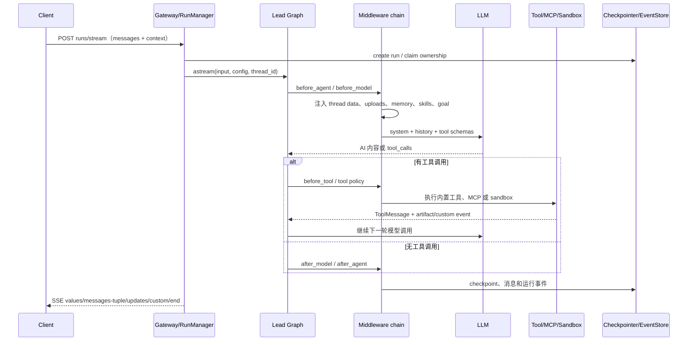

# DeerFlow 项目学习：架构、实现与工程设计

> 本文面向希望真正读懂 DeerFlow 的开发者。它不是 API 参考，而是一份“从整体心智模型进入源码”的学习文档：先解释系统由哪些边界组成，再追踪一次请求如何执行，最后拆解记忆、agent、工具、沙箱、事件流和持久化的设计取舍。
>
> 代码会持续演进，本文以当前仓库实现为准。阅读时建议把本文中的路径与源码对照，尤其是 `backend/packages/harness/deerflow/` 和 `backend/app/gateway/`。

## 1. 先建立一个正确的心智模型

DeerFlow 不是一个“调用一次 LLM 的聊天页面”，而是一个带运行时的 super-agent harness：

```text
用户 / IM 渠道 / 定时任务 / 嵌入式 Python 客户端
                    |
                    v
          Gateway（FastAPI，身份、路由、运行生命周期）
                    |
                    v
       Harness（LangGraph agent + middleware + tools）
          |             |              |
          v             v              v
       长期记忆       沙箱执行       subagent 委派
          |             |              |
          +-------------+--------------+
                        |
                        v
       Checkpointer / Store / Run Event Store / StreamBridge
                        |
                        v
              Web UI（Next.js + LangGraph SDK）
```

最重要的三个状态概念必须分开：

| 状态 | 解决的问题 | 典型实现 | 生命周期 |
| --- | --- | --- | --- |
| 会话状态（Thread State） | 当前对话有哪些消息、todo、artifact、goal | LangGraph state / checkpoint | 按 thread 持续 |
| 运行状态（Run State） | 这一次执行是否排队、运行、取消、失败，谁拥有它 | `RunManager` + run store + event store | 按 run 创建和终结 |
| 长期记忆（Memory） | 跨 thread 保存用户画像、偏好、事实和知识 | `MemoryManager` 插件及后端 | 按 user/agent 持久化 |

如果把三者混在一起，会误解很多行为：编辑并重跑只回滚会话 checkpoint，不会撤销文件副作用；记忆更新通常是异步的，不等于当前 thread 的 checkpoint；SSE 断线恢复依赖事件序号和持久化状态，不依赖浏览器内存。

## 2. 服务拓扑与请求边界

默认部署由四类服务组成：

| 服务 | 默认端口 | 责任 |
| --- | ---: | --- |
| Nginx | 2026 | 唯一外部入口；静态页面、API 反向代理、SSE/WebSocket 透传 |
| Gateway | 8001 | FastAPI REST、LangGraph 兼容 runs API、agent 运行时 |
| Frontend | 3000 | Next.js 16 App Router 的聊天和工作区 |
| Provisioner | 8002（可选） | Kubernetes/provisioner 沙箱的创建与回收 |

生产 compose 还会使用 Redis：它承担跨 worker 的 stream bridge，而不是 agent 的业务状态。默认 Gateway 单 worker，是因为运行中的任务、取消信号、IM channel 服务仍有进程内部分；多 worker 需要 Postgres、Redis stream bridge、run ownership heartbeat 和 DB event store 一起配置。

Nginx 的关键路由规则在 [`docker/nginx/nginx.conf`](docker/nginx/nginx.conf)：

```text
/api/langgraph/*  --rewrite-->  Gateway /api/*
/api/*                         Gateway REST
/api/sandboxes                  Provisioner（启用时）
其他路径                         Frontend
```

Nginx 对 SSE 关闭 buffering 和 cache，并将长超时、`X-Accel-Buffering: no`、HTTP/1.1 传给 Gateway；浏览器控制的 live browser stream 则额外升级为 WebSocket。

一次普通聊天请求的边界如下：

```text
浏览器
  -> useThreadStream / LangGraph SDK
  -> POST /api/langgraph/threads/{thread_id}/runs/stream
  -> Nginx rewrite
  -> FastAPI thread_runs.stream_run
  -> RunManager 创建 run 记录、做并发检查和 ownership
  -> 后台 asyncio task 执行 run_agent / graph.astream
  -> StreamBridge 发布事件；RunEventStore 持久化可审计事件
  -> SSE 返回 values、messages-tuple、updates、custom 等事件
  -> 前端合并 checkpoint、增量消息和 optimistic 状态
```

入口代码：

- Gateway 组装和 lifespan：[`backend/app/gateway/app.py`](backend/app/gateway/app.py)
- thread run 路由：[`backend/app/gateway/routers/thread_runs.py`](backend/app/gateway/routers/thread_runs.py)
- 无 thread 的 stateless run：[`backend/app/gateway/routers/runs.py`](backend/app/gateway/routers/runs.py)
- 浏览器端线程和 SSE 处理：[`frontend/src/core/threads/hooks.ts`](frontend/src/core/threads/hooks.ts)
- SDK 单例和 stream gap 恢复：[`frontend/src/core/api/api-client.ts`](frontend/src/core/api/api-client.ts)

## 3. 仓库分层：Harness 与 App 的边界

### 3.1 `backend/packages/harness`：可复用的 agent 平台

该包的导入名是 `deerflow.*`，目标是把 agent 能力做成可嵌入、可测试、可扩展的 Python 包。主要目录：

```text
deerflow/
├── agents/             agent factory、lead agent、ThreadState、middleware
│   ├── lead_agent/     配置驱动的主 agent 和 system prompt
│   ├── middlewares/    上下文、记忆、限流、安全、工具输出等横切逻辑
│   └── memory/         MemoryManager 契约、后端、工具、队列
├── runtime/            run、事件、checkpoint、store、stream bridge
├── subagents/          subagent registry、executor、状态契约、步骤事件
├── sandbox/            Sandbox 抽象、Provider、路径映射、文件和 bash 工具
├── tools/              工具注册、内置工具、MCP 元数据和工具搜索
├── skills/             SKILL.md 发现、解析、投影、权限和安全扫描
├── models/              provider/model factory、凭证和 provider patch
├── mcp/                MCP session、工具缓存、OAuth 和动态工具
├── config/              Pydantic 配置模型、路径、热加载边界
├── extensions/         外部 Python middleware/plugin 加载和排序
└── client.py           无 HTTP/无 Nginx 的嵌入式 DeerFlowClient
```

### 3.2 `backend/app`：产品化 Gateway 和外部渠道

`app.*` 负责产品边界，而不是 agent 的领域逻辑：

- `gateway/routers/`：认证、thread、run、upload、memory、MCP、skills、agents、scheduled tasks 等 REST 路由。
- `gateway/auth*`：登录、session cookie、CSRF、内部调用身份和授权。
- `gateway/services.py`、`deps.py`：依赖注入和运行时组件访问。
- `channels/`：Feishu、Slack、Telegram、Discord、DingTalk、WeCom、WeChat、GitHub 等 IM 入口。
- `scheduler/`：定时任务轮询和通过同一 run lifecycle 派发任务。

这个边界的工程意义是：可以用 `DeerFlowClient` 直接嵌入 Harness，也可以通过 Gateway 做多租户、鉴权、SSE、IM 和运维；agent 本身不需要知道请求来自网页还是飞书。

### 3.3 Frontend：以 thread 为中心的状态客户端

前端采用 Next.js 16、React 19、TypeScript、Tailwind、TanStack Query 和 LangGraph SDK。源码重点：

- `src/app/`：App Router 页面、认证、workspace、custom agent、docs/blog。
- `src/core/api/`：API client、stream mode 白名单、gap 恢复。
- `src/core/threads/`：thread 创建、历史分页、流合并、提交、停止、重跑、编辑重跑。
- `src/core/tasks/`：subagent 任务卡、步骤时间线、token usage 折叠。
- `src/components/workspace/`：消息、输入框、artifact、sidecar、browser、settings。

前端采用“服务端持久状态 + 流式临时状态 + 少量 optimistic 状态”的组合：TanStack Query 管理服务器数据，thread hook 合并 checkpoint/history/SSE，sessionStorage 只保存草稿、面板选择等浏览器 UI 状态。

### 3.4 IM channels 与 scheduler：不同入口，共用同一运行时

IM channel（Feishu、Slack、Telegram 等）的职责是把平台消息规范化为 DeerFlow 的 `thread_id + user_id + text + attachments + context`，然后调用 Gateway 的内部 runs API；它们不重新实现 agent loop。出站消息也消费同一套 run event/custom event，再映射为平台卡片、文本或文件。

定时任务同样只负责“什么时候触发”：

```text
Scheduler poller
  -> 读取 scheduled_tasks / cron
  -> DB partial unique index 检查 overlap_policy=skip
  -> 创建 scheduled_task_run
  -> internal-auth dispatch 到标准 RunManager
  -> 正常 checkpoint、事件、记忆、workspace change 和终态
```

这条约束很重要：如果 scheduler 另写一套 agent 执行逻辑，取消、审计、SSE、token usage 和错误处理会立即分叉。后台 run 还会把 `ask_clarification` 从 lead-agent 工具集移除，确保非交互调用不会悬挂等待用户。

## 4. 配置与启动：为什么配置是运行时的一等公民

根目录的 `config.yaml` 和 `extensions_config.json` 是运行时配置，模板分别是 [`config.example.yaml`](config.example.yaml) 和 `extensions_config.example.json`。配置通过 Pydantic 模型解析，典型顺序是：

```text
环境变量 / 路径解析
        -> AppConfig（模型、工具、memory、sandbox、database...）
        -> Gateway lifespan 初始化持久化与 provider
        -> 每次 make_lead_agent 根据 RunnableConfig 选择模型、agent、工具和 middleware
```

配置中的 `use: module:path` 是刻意保留的扩展点，例如：

```yaml
sandbox:
  use: deerflow.sandbox.local:LocalSandboxProvider

memory:
  enabled: true
  manager_class: deermem
  mode: middleware
```

动态导入意味着配置文件是受信任的代码加载边界：自定义模型、tool、sandbox、guardrail、MCP server、middleware 都可能执行 Python 代码，因此不能把这些字段暴露成不受控的普通用户写接口。

启动阶段大致做这些事：

1. 加载和校验 config，建立 runtime home、线程目录、skills 投影和数据库连接。
2. 建立 LangGraph checkpointer、LangGraph Store、DeerFlow 应用数据的统一存储。
3. 创建 `RunManager`、`RunEventStore`、`StreamBridge`，并做 orphan run reconciliation。
4. 初始化 memory manager、可选 retrieval index、sandbox provider、MCP/skills registry。
5. 启动 scheduler 和 IM channels；关闭时先停止新任务，再 drain run、flush memory queue、关闭 provider。

## 5. Agent 运行时：从 Lead Agent 到工具循环

### 5.1 Agent 的创建方式

源码提供两层 factory：

- [`deerflow.agents.factory.create_deerflow_agent`](backend/packages/harness/deerflow/agents/factory.py)：纯 Python 参数，适合 SDK、测试和嵌入式场景；可以用 `RuntimeFeatures` 声明式开启 middleware。
- [`make_lead_agent`](backend/packages/harness/deerflow/agents/lead_agent/agent.py)：读取 AppConfig、thread metadata、custom agent 配置，组装产品默认的 lead agent。

最终都调用 LangChain/LangGraph 的 `create_agent`，得到一个可 checkpoint、可 `astream`、可挂 middleware 的 compiled graph。`create_agent` 不是一个简单函数调用，而是把“模型节点 + 工具节点 + middleware hook”编译为可重复运行的图。

### 5.2 默认 middleware 链

具体链会因配置和 custom agent 改变，但核心顺序的设计意图如下：

```text
ThreadData
  -> Uploads
  -> Sandbox
  -> DanglingToolCall
  -> Guardrail（可选）
  -> ToolErrorHandling
  -> Summarization（可选）
  -> Todo / Plan mode（可选）
  -> Title
  -> Memory
  -> Vision / ViewImage
  -> SubagentLimit
  -> LoopDetection
  -> TokenBudget
  -> Clarification（尾部）
```

这不是任意排序：

- sandbox、uploads 必须先准备 runtime state，后续工具才知道文件和路径。
- 错误处理、摘要、记忆都需要看到完整的消息生命周期。
- 限制类 middleware 放在工具能力之后，确保每一步都能拦截。
- clarification 放在尾部，避免自定义 `@Next` middleware 把它从最终交互边界上挪走。
- 外部扩展 middleware 通过 `@Next`/`@Prev` 插入，并做冲突、循环依赖和未解析 anchor 检查。

### 5.3 一次 lead-agent 调用的时序



更具体地说，模型每一轮会在“产生 AI message”和“执行 tool”之间循环，直到：

- 模型返回最终文本；
- middleware 产生 clarification interrupt，等待用户下一条消息；
- 达到 token/turn/recursion limit；
- safety、loop detection、模型错误处理提前终止；
- 客户端或 scheduler 取消 run。

`ThreadState` 是图的共享状态，通常包含 `messages`、`artifacts`、`todos`、`title`、`goal`、`sandbox`、`thread_data` 等字段。状态写入不是直接覆盖 JSON，而是由 LangGraph channel/checkpoint 机制保存；可选 `checkpoint_channel_mode: delta` 用增量 channel 降低快照开销，但持久化路径必须经过应用层的 mode marker 和兼容性 gate。

### 5.4 Agent 调用的身份与上下文传播

Gateway 在服务端写入的 runtime context 会贯穿 lead agent、工具、subagent：

- `thread_id`、`run_id`：定位会话和执行。
- `user_id`、`user_role`、`authz_attributes`：授权和审计。
- `agent_name`、`model_name`、`tool_groups`：custom agent 和模型/工具选择。
- `trace_id`：Langfuse/LangSmith/Monocle 追踪关联。
- `is_internal`：scheduler、IM 内部调用的受信身份标记。

客户端提交的 `context.non_interactive` 不可信；只有内部认证的 scheduler launch path 才能让 lead agent 去掉 `ask_clarification`，从而保证后台任务不会永远等待人。

## 6. Subagent 调用逻辑：`task` 工具如何工作

### 6.1 调用路径

Lead agent 并不是直接递归调用另一个 graph，而是把 `task` 暴露为一个普通工具。模型决定调用时：

```text
Lead LLM
  -> task(description, prompt, subagent_type)
  -> 读取 registry/config，解析 general-purpose、bash 或 custom 类型
  -> 继承 parent 的 thread/user/trace/authz/sandbox context
  -> SubagentExecutor.execute_async()
  -> 后台任务执行独立 agent graph
  -> task_tool 每 5 秒轮询结果
  -> 发布 task_started/task_running/task_completed/... custom events
  -> 返回 ToolMessage 给 lead agent
  -> Lead LLM 根据结果继续综合
```

关键实现位于 [`backend/packages/harness/deerflow/tools/builtins/task_tool.py`](backend/packages/harness/deerflow/tools/builtins/task_tool.py)、[`backend/packages/harness/deerflow/subagents/executor.py`](backend/packages/harness/deerflow/subagents/executor.py) 和 [`backend/packages/harness/deerflow/subagents/registry.py`](backend/packages/harness/deerflow/subagents/registry.py)。

### 6.2 隔离与继承原则

- subagent 使用自己的 graph、消息历史和超时；不会把完整父上下文无界复制进去。
- 继承父 agent 的模型（除非 custom subagent 有 override）、工具组、trace、用户身份和授权属性。
- subagent 默认关闭 `task`，防止无限递归；bash subagent 只有在安全沙箱和配置允许时可用。
- `sandbox_state` 和 `thread_data` 可作为启动上下文传入，使子任务能读写同一个 thread 工作空间，但工具权限仍由 subagent 自己的工具集决定。
- 每次 task 通过 `tool_call_id` 作为可追踪 `task_id`，前端可把 live event 与历史 event 折叠成同一张子任务卡。

### 6.3 并发、预算与终止

`SubagentLimitMiddleware`、`subagents.max_total_per_run`、`max_concurrent_subagents`、单 subagent timeout、token ceiling 共同构成资源保护：

- 独立只读研究可以并行，共享文件的连续修改应留在 lead agent 或显式串行。
- 达到 token cap 时可以返回带 `subagent_stop_reason=token_capped` 的可用结果，而不是把部分结果当成系统崩溃。
- cancel 会先请求合作式停止；如果父 run 被取消，task_tool 会等待子任务进入终态，尽量把 token usage 写回父 run，再做延迟清理。
- 前端用 `task_running` 的累计 usage 和 `message_index` 去重，防止 SSE 重连后重复加总。

### 6.4 为什么用后台 executor + 轮询

这种设计让主 graph 的 tool 节点保持可控：它不会把一个长时间 subagent 调用阻塞在同一个事件循环栈上，且可以在子任务运行期间持续向 UI 发布进度。代价是需要状态契约、轮询间隔、超时、清理和父子取消传播；这些复杂度集中在 `SubagentExecutor` 和 `task_tool`，而不是散落在每个 agent 中。

## 7. 记忆系统：短期与长期

DeerFlow 的“记忆”不是单一机制，而是横跨三层、各自独立又互相串联的体系。阅读前先分清：

| 层 | 机制 | 存什么 | 生命周期 |
| --- | --- | --- | --- |
| 短期 | LangGraph `ThreadState` + checkpoint | 本 thread 的 `messages`、`todos`、`artifacts` | 按 thread 持续 |
| 压缩 | `SummarizationMiddleware` | `summary_text` 滚动摘要 + 保留的尾部消息 | 按 thread，触发式滚动 |
| 长期 | `MemoryManager` + DeerMem | `user`/`history` 摘要 + `facts[]` | 按 `(user_id, agent_name)` 跨 thread |

三者形成闭环：短期消息超限后由压缩层转成摘要；压缩前把“即将被遗忘的上下文”通过 `memory_flush_hook` 转交长期记忆；长期记忆再由 `DynamicContextMiddleware` 以冻结快照回注到下一次会话开头。

### 7.1 短期记忆：会话上下文与压缩

#### Thread State：原始短期记忆

最直接的短期记忆是 LangGraph 的 `ThreadState`：图的共享状态，`messages` 字段存本 thread 的全部消息，由 Checkpointer 持久化（SQLite/Postgres）。它不是 JSON 直接覆盖，而是走 LangGraph 的 channel/reducer（`add_messages` 按消息 ID 去重合并）。编辑重跑、断线恢复都依赖它。

#### SummarizationMiddleware：上下文压缩

当 token 超过 `trigger` 阈值时，把旧消息用 LLM 压成一段 `summary_text`，只保留 `keep` 指定的尾部消息。核心类 `DeerFlowSummarizationMiddleware`（[`agents/middlewares/summarization_middleware.py`](backend/packages/harness/deerflow/agents/middlewares/summarization_middleware.py)）：

```text
before_model / abefore_model
  -> _prepare_compaction()
       _should_summarize()               # 是否触发
       _determine_cutoff_index()         # 切到哪
       _partition_messages()             # 分成“要摘要的/保留的”
       _preserve_dynamic_context_reminders()  # 把日期/记忆注入三元组拎出来
  -> _summarize_with()                   # nostream 模型生成摘要
  -> { messages: [RemoveMessage(REMOVE_ALL_MESSAGES), *preserved],
       summary_text: ... }               # 旧消息整体移除，摘要写入 state["summary_text"]
```

关键实现细节：

- **摘要模型不污染流**：摘要调用发生在 middleware hook 里，若不处理，它的 token 会被 messages-tuple 回调当成“幻影 AI 消息”推到前端。摘要模型包了一层 `TAG_NOSTREAM`，让流处理器跳过它。
- **模型降级链**：按“配置的摘要模型 → run 自己的模型 → 默认模型”依次尝试，任一失败落到下一个；全失败则 fail-open，本轮状态不变（自动路径吞掉异常，下轮再试）。
- **防 prompt 注入**：摘要输入里的 `<existing_summary>` / `<new_messages>` 块内容都 `html.escape(quote=False)`，防止用户文本里的 `</new_messages>` 提前闭合块、伪造权威段落。
- **保护动态上下文三元组**：`_preserve_dynamic_context_reminders` 把 `DynamicContextMiddleware` 注入的 ID 交换三元组（`X` / `X__memory` / `X__user`）从“待摘要”救回“保留”区，否则注入点会丢失、用户问题会被压成散文。
- **手动 `/compact`**：走 `acompact_state(force=True, raise_on_failure=True)`，失败抛 `SummaryGenerationError` 以区别于“没有可压缩内容”。

摘要结果以 `HumanMessage(content=summary_text, name="summary")` 形式进入上下文，作为后续轮的“已压缩历史”。

#### DynamicContextMiddleware：日期与长期记忆的冻结快照

这一层是短期和长期的交汇点。它不在每轮重算，而是在会话第一次注入后冻结，保证前缀缓存可复用：

- **首轮**：把 `<system-reminder>`（日期）和 `<memory>`（长期记忆）注入到第一条用户消息前，用 ID 交换让 `add_messages` 原地替换：`SystemMessage(id=X)`（框架拥有的日期，带 `reminder_date`）+ `HumanMessage(id=X__memory)`（用户拥有的记忆内容）+ `HumanMessage(id=X__user)`（真实用户消息）。
- **安全边界（OWASP LLM01）**：框架数据放 `SystemMessage`，用户可影响的记忆内容刻意保留为 `HumanMessage`，避免不可信内容获得 system 权限；`_last_injected_date` 读 `additional_kwargs["reminder_date"]` 而非正则解析正文，防止用户伪造日期。
- **跨午夜**：检测到日期变化时，追加一条轻量日期更新提醒。
- **降级**：注入带 5 秒超时（`_INJECT_TIMEOUT_SECONDS`），并 `asyncio.to_thread` 卸载同步文件 I/O，冷启动 tiktoken 下载也不会卡死请求。

### 7.2 短期到长期的桥：memory_flush_hook

当摘要 middleware 要把旧消息移除时，先触发 `before_summarization` hook（[`agents/memory/summarization_hook.py`](backend/packages/harness/deerflow/agents/memory/summarization_hook.py)）：

```text
memory_flush_hook(event)
  -> manager.add_nowait(thread_id, messages_to_summarize, agent_name, user_id)
```

即：即将被摘要丢弃的消息，会先被“立即”（nowait）刷进长期记忆队列。这样压缩只丢上下文、不丢事实。子 agent 链用 `skip_memory_flush=True` 关闭它，避免把子 agent 的内部轮次写进父 thread 的长期记忆（子 agent 共享父的 `thread_id`）。

### 7.3 长期记忆：MemoryManager 契约与后端

#### 7.3.1 统一契约

[`MemoryManager`](backend/packages/harness/deerflow/agents/memory/manager.py) 是后端无关的 Pydantic/ABC 契约，方法分三层：

- **Tier 1（必须实现）**：`add(thread_id, messages, agent_name, user_id, trace_id)` 排队写入、`get_context(user_id, agent_name, thread_id)` 返回注入文本。
- **Tier 2（带默认值）**：`add_nowait`、`search(query, top_k, ...)`、`get_memory`、`clear_memory`、`import_memory`、`shutdown_flush(timeout)`，默认抛 `NotImplementedError`。
- **Tier 3（可选钩子）**：`warm`、`reload_memory`、`create_fact` / `update_fact` / `delete_fact`。

两个不变式在实例化时校验：`supports_search`（ClassVar）必须与是否真正覆写 `search()` 一致，二者不能漂移；`mode == "tool"` 必须实现 `search()`，否则启动即报错。

后端发现是 drop-in：`backends/<name>/` 目录暴露 `MANAGER_CLASS` 即可注册。`get_memory_manager()` 用双重检查锁做单例初始化，`manager_class` 可以是内置名称（`deermem`、`mem0`、`openviking`、`noop`）或 dotted import path。Host 只依赖契约，不依赖具体 facts 存储模型。

#### 7.3.2 两种运行模式

**Middleware 模式**：每次 agent run 的 `MemoryMiddleware.after_agent/aafter_agent` 把对话交给 manager；下一轮调用前，middleware 通过 `get_context()` 把长期记忆包进 `<memory>...</memory>` 系统上下文。

```text
当前对话完成
  -> filter user + final assistant
  -> memory backend 异步更新
下一次模型调用
  -> 读取 user-global + agent facts
  -> token budget 截断
  -> 注入 system message
```

**Tool 模式**：模型自己调用 `memory_search`、`memory_add`、`memory_update`、`memory_delete`。自动注入通常只放 user/history 全局摘要，agent facts 由查询结果提供，避免同一事实同时出现在 system prompt 和 tool 返回值中。Tool 模式把写入主动权交给模型，灵活但依赖模型是否正确调用工具；因此 backend 可以声明 `requires_passive_writes_in_tool_mode=True`，保留被动对话抽取，同时提供 query-aware search。

#### 7.3.3 DeerMem 写入链路

DeerMem 是默认本地 backend，代码在 [`agents/memory/backends/deermem`](backend/packages/harness/deerflow/agents/memory/backends/deermem)，把“抽取、存储、检索、并发和兼容性”都放在本地 backend 内。

```text
MemoryMiddleware.after_agent
  -> manager.add(...)
  -> filter_messages_for_memory（用户消息 + 最终 AI 答案，丢 tool 轮）
  -> filter_trivial（去掉“好的”“收到”等无信息轮）
  -> detect_signals（correction/reinforcement/preference/goal/decision...）
  -> MemoryUpdateQueue（去抖、合并、背压）
  -> updater.update_memory()：memory_update LLM 抽取
  -> scope/durability/authority 写门禁 + confidence 阈值
  -> Updater 原子写入 memory.json + facts/*.md + 检索索引
```

队列（`queue.py`）是 daemon worker：

- `debounce_seconds=30`：短时间内的多轮合并成一次抽取。
- `queue_max_depth=1000`：满时普通更新拒绝（`QueueFull`），但 **signal 更新永远放行**，重要记忆不被背压丢弃。
- **watermark 只在成功抽取后推进**：失败不推进，下一轮重新喂入，保证“丢了就重抽”。watermark 按 `(thread_id, user_id, agent_name)` 用内容/ID 定位（而非索引，因为摘要移除头部后索引会错位），是有界 LRU（`watermark_max_keys=4096`）。
- 进程退出走 `shutdown_flush(timeout)`，把 debounce buffer 里还没抽的刷完（对齐 K8s `terminationGracePeriodSeconds`）。

#### 7.3.4 数据结构与存储布局

`memory.json` 顶层三块（`create_empty_memory`）：

```jsonc
{
  "user": {
    "workContext":     { "summary": "...", "updatedAt": "..." },
    "personalContext": { "summary": "...", "updatedAt": "..." },
    "topOfMind":       { "summary": "...", "updatedAt": "..." }
  },
  "history": {
    "recentMonths":      { "summary": "...", "updatedAt": "..." },
    "earlierContext":    { "summary": "...", "updatedAt": "..." },
    "longTermBackground":{ "summary": "...", "updatedAt": "..." }
  },
  "facts": [
    { "id": "fact_xxxx", "content": "...", "category": "context",
      "confidence": 0.9, "createdAt": "...", "source": "<thread_id|manual>",
      "scope": "user", "durability": "durable", "authority": "descriptive",
      "expected_valid_days": 90 }
  ],
  "revision": 12
}
```

`user`/`history` 六个 summary 段是分层的：`recentMonths` 最近、`longTermBackground` 最久远，给模型时间颗粒度。存储布局（v2）：

```text
{runtime_home}/users/<user_id>/
├── memory.json                    # user/history 摘要 + revision + 时间元数据
└── agents/<agent_name>/facts/
    ├── <shard>/<fact_id>.md       # canonical fact，带 frontmatter
    └── ...
```

没有显式 `agent_name` 的旧调用落入保留桶 `__default__`。`user`/`history` 跨 agent 共享，facts 按 agent 隔离。旧版把 facts 塞在 JSON 中，首次读取或 CLI migration 会迁移到 Markdown，并保留 `.v1.bak` 保护源数据。

#### 7.3.5 写门禁与事实生命周期

模型每次产出的更新数据经 `_apply_updates` 应用时，经过多层确定性过滤：

- **scope gate（确定性）**：每个 fact 必须 `scope=user`、`durability=durable`、`authority=descriptive`，否则按原因（missing/scope/durability/authority）计数拒绝。这是独立于模型行为的保护，模型乱分类也不会写入越权/临时/指令性内容。
- **confidence 阈值**：默认 `fact_confidence_threshold=0.7`，低于阈值丢弃。
- **去重**：按归一化 content key 去重，`create_memory_fact` 在 revision 重试循环内检查，并发创建者不会存进重复内容。
- **上限**：`max_facts=100`，超限按 confidence 从高到低裁剪。
- **矛盾删除要成对**：`factsToRemove` 若带 `replacementFactIndex`，只有当替代事实真的已通过所有 gate 且落到最终内存里，才允许删除旧事实——任务内矛盾不能删用户记忆，失败的成对替换不能退化成只删不增。

**staleness review（过期复核）**：`staleness_age_days=90` 超龄 fact 成为候选；保护类别 `staleness_protected_categories=["correction"]` 免于复核；每轮删除上限 `staleness_max_removals_per_cycle=10`；`staleFactsToExtend` 给保留 fact 延长 `expected_valid_days`（上限 `staleness_max_extension_days=3650`）。创建时 `expected_valid_days` 被 `staleness_age_days × staleness_max_lifetime_multiplier`（90×20=1800 天）钳制，模型不能给 fact 一个永不复核的寿命。

**consolidation（合并）**：默认关闭（`consolidation_enabled=False`），因为它有损——合并后只留 `consolidatedFrom` ID 不保留原文，需要先有备份/审计。

#### 7.3.6 并发与数据完整性

- journaled writes + shared user lock：避免多个线程同时改同一用户文件。
- optimistic user-memory revision 和 fact revision：检测写入冲突，Gateway 把冲突翻译为 HTTP 409。
- 单事实 upsert/delete 只重写目标文件和索引条目，不把整个文档当作缓存快照覆盖。
- summary partial update 只 merge 提供的 child keys，避免遗漏字段导致数据擦除。
- `clear`、consolidation、trimming 这类 snapshot 操作遇到 revision 冲突会重新加载并重算，而不是重放过期删除集合。

#### 7.3.7 检索链路

默认使用可重建的 SQLite FTS5/BM25 derived index（`.retrieval/memory-fts5.sqlite3`）；索引损坏可自动重建，未安装中文 tokenizer 时退回大小写不敏感 substring 搜索。索引不是 canonical data，真正事实仍在 Markdown 文件中，因此可以删掉 `.retrieval/` 后重建。

```text
memory_search(query)
  -> ensure scoped index warm
  -> FTS5/BM25 hybrid search + category filter
  -> compatibility fact shape
  -> 失败/无结果时 substring fallback
```

- **分词**：中文用 jieba（可选，未装则退到 whitespace），英文按空格。
- **查询策略**：检测到 FTS5 高级语法（AND/OR/NOT/短语/前缀）直接透传；自然语言则 jieba 分词 + OR join；语法错误回退到 tokenized OR。
- **排序**：`score = BM25 × time_decay + confidence × 0.2`，其中 `time_decay = 1.0`（30 天内）否则 `exp(-0.01 × (age_days - 30))`。
- **隔离**：`scope_user`/`scope_agent` 两列做用户/agent 隔离，category 过滤在 top_k 切片之前。

#### 7.3.8 记忆注入预算

`max_injection_tokens`（默认 2000）是硬上限；计数可用 tiktoken 或字符（`token_counting`）。DeerMem 先保证 `guaranteed_categories=["correction"]` 的关键类别（独立 `guaranteed_token_budget=500`），再按预算压缩其余事实。注入时把 memory 序列化成 `<current_memory>` 块，先 `html.escape` 每个叶子字符串再 `json.dumps`，防止用户可影响的 fact content 里出现 `</current_memory>` 提前闭合块。手动 fact 在喂给抽取 LLM 的副本里加 `[MANUAL]` 前缀（prompt-only 信号，不污染持久化）。注入文本由 backend 生成，middleware 只负责 gate 和 `<memory>` 包装，这保证其它 backend 不必伪装成 DeerMem 的数据格式。

#### 7.3.9 mem0、OpenViking 与 noop

**mem0**（[`Mem0Manager`](backend/packages/harness/deerflow/agents/memory/backends/mem0/mem0_manager.py)）通过 HTTP 调用 mem0 Platform 或兼容服务：`(user_id, agent_name)` 映射到 `user_id/agent_id`，thread 映射到 `run_id`；`add` 只做过滤和角色映射，抽取去重存储由服务端完成；`read_policy`/`write_policy` 可选 fail-open 或 log-and-drop；不保留本地 queue/watermark/cache，天然适合多 worker，但依赖外部服务可用性。

**OpenViking**（[`OpenVikingMemoryManager`](backend/packages/harness/deerflow/agents/memory/backends/openviking/openviking_manager.py)）通过 HTTP 把过滤后的会话提交给 OpenViking Sessions，并将远程 search hits 映射为 DeerFlow facts：当前主要支持 middleware 模式；`get_context` 用配置的 `injection_query` 检索而非把整个远程库搬回 prompt；适合把向量/层级记忆交给专用服务，代价是部署多一个系统。

**noop** 满足契约但不保存、不注入，用于关闭记忆或测试。自定义 backend 只需：继承 `MemoryManager`；实现 `add` 和 `get_context`；若支持 tool 模式则实现 `search` 并设 `supports_search=True`；暴露 `MANAGER_CLASS` 或配置完整 import path；处理 close、失败策略、user/agent scope 和 token budget。真正稳定的扩展点是“契约 + host hook”，不是复制 DeerMem 的内部类——backend 可以不使用 facts，甚至可以是远程向量库，只要返回 injection text 和兼容的 search result。

## 8. Tools、Skills、MCP：能力的三种来源

### 8.1 内置工具

工具由 [`deerflow.tools`](backend/packages/harness/deerflow/tools) 根据 config、模型、tool groups、subagent_enabled 等条件注册。典型能力：

- 文件：`ls`、`glob`、`grep`、`read_file`、`write_file`、`str_replace`。
- 执行：sandbox 内 `bash`。
- 协作：`task`、`ask_clarification`。
- 展示：`present_file`、`view_image`。
- 运行时：`tool_search`、skill 管理、memory CRUD。

工具 schema 是否暴露给模型与是否允许执行是两道判断：skill policy、authorization、subagent 限制和 middleware 会在工具注册和调用时分别过滤。

### 8.2 Skills：渐进发现与权限收缩

Skill 是带 `SKILL.md` 的可装载能力包，来源包括 `skills/public`、`skills/custom` 和 managed integrations。核心流程：

```text
catalog/describe -> 读取 SKILL.md -> slash 激活或显式上下文加载
                  -> 解析 frontmatter 和 allowed-tools
                  -> 生成模型可见说明、sandbox /mnt/skills 投影
                  -> Skill tool policy middleware 过滤 schema 与执行
```

仅“启用/列出” skill 不会自动收缩工具集；显式 slash 激活后，`allowed-tools` 才成为当前 skill 的权威限制。`task` 不是 framework 豁免工具，限制性 skill 必须显式允许它。技能扫描器会对 prompt injection、危险脚本和包结构做只读审查。

### 8.3 MCP

MCP server 可以通过 stdio 或 HTTP 提供工具。DeerFlow 负责 session pool、OAuth、工具缓存、元数据和路由；大量 MCP 工具启用 `tool_search` 时可延迟加载 schema，避免一次模型上下文塞入全部工具。

MCP 配置放在 `extensions_config.json`，而 Python plugins 的顶层 `plugins:` 列表放在 `config.yaml`，这是刻意的信任边界：API 可以管理 MCP/skills 的启用状态，但不应通过普通 API 写入任意 Python import。

## 9. Sandbox：把文件和命令变成 per-thread 工作空间

沙箱抽象由 [`Sandbox`](backend/packages/harness/deerflow/sandbox/sandbox.py) 和 [`SandboxProvider`](backend/packages/harness/deerflow/sandbox/sandbox_provider.py) 定义。middleware 负责在 agent 生命周期中把 sandbox 放到 state/runtime；工具只依赖抽象接口。

可选 provider 包括：

- `LocalSandboxProvider`：本机进程和目录映射，适合受信任的本地开发；host bash 默认关闭。
- AIO/Docker：为 thread 获取隔离容器，工具通过 HTTP/容器 API 执行。
- BoxLite/E2B/Tenki/Kubernetes provisioner：提供更强的微 VM、云沙箱或远程 Pod 隔离。

通用生命周期：

```text
首次需要工具
  -> provider.acquire(thread_id, user_id)
  -> 建立 /mnt/user-data/workspace、outputs、uploads、skills 映射
  -> 工具执行并记录审计/文件变更
run 结束
  -> 通常保留 warm sandbox 以便同一 thread 复用
Gateway shutdown
  -> provider.shutdown()，回收容器/VM/本地缓存
```

沙箱不是记忆：工作区文件属于 thread/user 数据，长期记忆是事实抽取；用户上传文件也不会被当作 agent 生成的 workspace change。

## 10. 持久化、事件与流式恢复

### 10.1 Checkpointer、Store、Event Store 的分工

```text
LangGraph Checkpointer  : graph 的 checkpoint、可恢复的 ThreadState
LangGraph Store          : threads、metadata、跨请求索引
Run Store                : run status、ownership lease、取消动作
Run Event Store          : 顺序事件、消息页、审计、subagent steps
StreamBridge             : 把 live event 发给 SSE subscriber，支持跨 worker
```

数据库配置在 `config.yaml` 的 `database` 段，可使用 memory、SQLite 或 Postgres。多 worker/生产环境应选择 Postgres；进程内 memory 只适合单实例开发。

### 10.2 RunManager 与 ownership

`RunManager` 在内存维护活跃任务，同时把状态写入 run store。启用 heartbeat 时：

- worker 定期续租 lease；
- 发现其它 worker 的 lease 过期，会把 orphan run 标记为 error/interrupted；
- 本地续租失败会 fence 当前任务，防止旧 worker 在被接管后继续写终态；
- Gateway 关闭先取消并 drain 活跃任务，避免 checkpointer 连接池先关闭。

这解决了“HTTP 请求已经断开，但 agent 仍在运行”和“worker 崩溃后任务永远 stuck”两个生产问题。

### 10.3 SSE 事件与 gap 恢复

StreamBridge 默认可以是内存实现，生产多 worker 使用 Redis Streams。客户端通过 `Last-Event-ID` 提交重连 cursor。若 cursor 已被 trim 或落后到不可恢复位置，后端发送机器可读的 `gap` 事件：

```text
gap
  -> 前端清掉过期 reconnect metadata
  -> 重新 GET durable thread values/history
  -> 从服务端保留的 tail 重新 join run stream
  -> 最多有限次数恢复，失败才提示用户
```

前端不能把 `gap` 当普通 stream finish；否则会把一个仍在运行的后端 run 错误地显示为已完成。`values` 是完整状态快照，`messages-tuple` 是增量消息；subgraph namespaced values 不得覆盖 root thread state。

### 10.4 应用数据与迁移

LangGraph 的 checkpoint/store 表与 DeerFlow 应用表（用户、session、scheduled task、feedback、channel 配置等）可以共享统一 `database` backend，但概念上仍是不同数据域。SQLite 适合单实例，Postgres 才能提供多 worker 下的事务、唯一索引和 ownership 协调。数据库 schema 通过 Alembic revision 管理，新增持久化字段应同时考虑：

- 旧版本数据库能否启动并迁移；
- API 写入与 LangGraph checkpoint 是否需要同一事务；
- worker 崩溃后是否能从 durable row 恢复；
- 事件保留/trim 后，客户端是否仍能用 history 重建界面。

事件表与消息页保留的是“可回放事实”，前端的渲染模型只是这些事实的一个投影。因此不要把 UI 临时字段写进核心 checkpoint，应该使用 metadata、artifact、custom event 或专用应用表。

## 11. Frontend 数据流的阅读方法

建议按下面顺序读前端：

1. [`src/app/workspace/chats/[thread_id]/page.tsx`](frontend/src/app/workspace/chats/[thread_id]/page.tsx)：页面负责把 route、agent_name、composer、side panel 组合起来。
2. [`src/core/threads/hooks.ts`](frontend/src/core/threads/hooks.ts)：核心状态机，处理提交、SSE、历史、重连、停止、regenerate、edit-and-rerun。
3. [`src/core/api/api-client.ts`](frontend/src/core/api/api-client.ts)：LangGraph SDK 单例和 gap wrapper。
4. `src/core/messages/`：消息 identity、tool result、human input、reasoning 和隐藏消息协议。
5. `src/core/tasks/`：将 `task_*` custom events 和历史 event rows 折叠为 subtask steps。
6. `src/components/workspace/messages/`：把“处理中步骤”和“最终 assistant bubble”分开渲染。

一次前端提交不是简单 `fetch`：

```text
InputBox
  -> 解析 /skill、/goal、/compact、附件、人类输入回复
  -> buildThreadSubmitMessages
  -> useThreadStream.sendMessage
  -> SDK stream（values + messages-tuple + custom）
  -> optimistic human message
  -> 按 message identity / tool_call_id 去重合并
  -> durable history 与 live state 对齐
  -> run 完成后刷新 title、artifacts、token usage、workspace changes
```

前端的复杂性主要来自“同一条消息有多个来源”：checkpoint history、SSE 增量、optimistic message、隐藏 middleware message、重连 replay。`hooks.ts` 的 ledger、canonical identity、页序列 `seq` 和 merge 逻辑是为了让 UI 在这些来源交错时仍然稳定，而不是普通 React state 的过度设计。

## 12. 安全与可靠性设计亮点

### 12.1 安全边界

- Nginx 默认 loopback 绑定，避免 agent 服务未经保护暴露公网。
- Gateway 有 session cookie、CSRF、CORS、内部 token 和授权 provider。
- host bash 对 LocalSandbox 默认关闭；需要明确配置才允许。
- skill 的 `allowed-tools` 在 schema 暴露和执行阶段都过滤，但它是行为约束，不是硬安全边界。
- 配置中的任意 import、MCP stdio command、sandbox provider 都属于受信任 operator 配置。
- 用户上传、thread workspace、memory facts 按 user/thread/agent scope 隔离。

### 12.2 背压与降级

- memory queue 满时记录 warning 并丢弃本次更新，不让记忆故障打断主回答；下一轮仍可重新提交 watermark 未推进的内容。
- mem0/OpenViking 可配置 read fail-open、write log-and-drop。
- tool 错误会转为 ToolMessage，让模型决定重试或换方案。
- 模型长度、token budget、loop detection、subagent cap 和 recursion limit 多层兜底。
- SSE gap 走 durable reload，而不是静默返回半截消息。

### 12.3 异步边界与线程安全

项目明确避免在 asyncio event loop 中做阻塞 I/O：SQLite、文件、同步 HTTP、子进程和部分 LangChain sync tool 会通过 `asyncio.to_thread` 或 worker pool offload。memory queue、run manager、sandbox provider、retrieval index 各自有锁和生命周期；shutdown 会用硬超时，宁可记录未完成尾部，也不无限卡住容器退出。

### 12.4 可观测性

run、LLM call、tool/MCP、subagent、memory LLM 都携带 trace metadata。可选 Langfuse、LangSmith、Monocle；run event store 同时承担产品调试、subagent 历史回放和审计。一个成熟 agent 系统必须同时回答“用户看到了什么”和“系统实际上执行了什么”，DeerFlow 把二者分别建模为可见消息与内部事件。

## 13. 典型场景的端到端解释

### 场景 A：用户要求“研究并生成报告”

1. 用户消息进入 thread run，lead agent 读取已有 memory、skills 和 workspace。
2. 模型决定调用 web/search 类工具，结果以 ToolMessage 和 progress event 返回。
3. 需要并行资料时，模型调用 `task`，启动多个 general-purpose subagents。
4. subagents 各自检索、读写沙箱文件，持续产生 task events。
5. lead 收集 task result，综合内容，调用 `write_file` 生成 `/mnt/user-data/outputs/report.md`。
6. `ThreadDataMiddleware` 和 workspace change recorder 记录文件变更；前端在 run 结束后刷新 artifact 内容和 diff 摘要。
7. MemoryMiddleware 将用户偏好/项目背景等 durable 信息排队抽取；一次性研究约束不会自动变成长期事实。

### 场景 B：用户说“记住我偏好中文回答”

1. 当前 run 正常完成。
2. DeerMem 过滤用户和最终 AI 消息，识别 preference signal。
3. memory update LLM 产出候选 fact，并经过 scope/durability/authority write gate。
4. Updater 在对应 user/agent facts Markdown 中原子写入，更新 retrieval index。
5. 下一条消息的 MemoryMiddleware 在 system prompt 注入该事实，或者 tool 模式由模型 `memory_search` 查询。

### 场景 C：SSE 中途断线

1. Gateway 的 run 仍由 RunManager 在后台运行，浏览器断线不会自动杀死 run。
2. 浏览器用 `Last-Event-ID` 重新连接。
3. 若事件仍保留，StreamBridge 从 cursor 继续；若产生 gap，前端先加载 durable values/history，再 join 保留 tail。
4. 前端按 canonical message identity 合并，避免重复 assistant/tool 消息。

## 14. 如何按顺序学习源码

### 第一阶段：建立骨架

阅读：

1. `README.md` 的 Architecture、Sandbox、Long-Term Memory、Subagents、Streaming 章节。
2. [`docker/docker-compose.yaml`](docker/docker-compose.yaml) 与 [`docker/nginx/nginx.conf`](docker/nginx/nginx.conf)。
3. [`backend/app/gateway/app.py`](backend/app/gateway/app.py) 的 lifespan 和 router 注册。
4. [`backend/packages/harness/deerflow/agents/lead_agent/agent.py`](backend/packages/harness/deerflow/agents/lead_agent/agent.py) 的 `_make_lead_agent`。

目标：能画出“浏览器 -> Gateway -> Graph -> Stream”四段链路。

### 第二阶段：读一次最小 agent run

阅读：

1. [`agents/thread_state.py`](backend/packages/harness/deerflow/agents/thread_state.py)。
2. [`agents/factory.py`](backend/packages/harness/deerflow/agents/factory.py)。
3. 一个简单工具，如 [`sandbox/tools.py`](backend/packages/harness/deerflow/sandbox/tools.py) 中的 `read_file_tool`。
4. `RunManager`、`thread_runs.py` 的 create/stream/cancel。

目标：回答“模型何时被调用、工具结果如何回到模型、checkpoint 何时落盘”。

### 第三阶段：读横切能力

按这个顺序读 middleware：`dynamic_context` -> `sandbox` -> `tool_error_handling` -> `summarization` -> `memory` -> `subagent_limit` -> `skill_tool_policy` -> `terminal_response`。

目标：理解 agent 的工程性来自 middleware 生命周期，而不是 system prompt 的长度。

### 第四阶段：深挖记忆

1. 先读 `MemoryManager` 契约。
2. 再读 `MemoryMiddleware`，理解 host 只负责 gate、上下文解析和生命周期。
3. 读 DeerMem 的 `queue.py`、`updater.py`、`storage.py`、`retrieval.py`。
4. 对比 mem0 和 OpenViking，观察同一契约如何适配远程服务。
5. 最后读 Gateway memory router 和前端 `core/memory`。

目标：明确“会话摘要、事实记忆、检索索引、模型上下文预算”各自在哪里。

### 第五阶段：读 subagent 与前端恢复

1. `task_tool.py` -> `subagents/executor.py` -> `status_contract.py`。
2. 前端 `core/tasks/` 如何消费 `task_*` custom events。
3. `core/api/api-client.ts` 的 gap recovery。
4. `core/threads/hooks.ts` 的 history/live/optimistic merge。

目标：理解长任务、重连、取消、历史回放为什么需要独立协议，而不能只靠一条聊天消息。

## 15. 设计亮点总结：值得迁移的工程思想

1. **契约优先的可插拔性**：MemoryManager、SandboxProvider、MCP、Skill、Model factory 都把变化隔离在 adapter 后面。
2. **运行时与产品层分离**：Harness 可被 Gateway、TUI、嵌入式 client 复用，HTTP 不是 agent 的前提。
3. **状态、事件、流三分法**：checkpoint 保证恢复，event store 保证审计，stream bridge 保证实时体验。
4. **横切能力 middleware 化**：记忆、摘要、限流、授权、工具错误、文件上传不污染模型节点。
5. **渐进披露工具**：skills 和 MCP 的 tool search 减少上下文压力，skill activation 再决定权限。
6. **异步更新与主链路解耦**：记忆抽取、标题、workspace summary 等非关键副作用不阻塞主回答，同时有 shutdown flush 和重试/降级。
7. **失败可解释、恢复可验证**：run status、stop reason、gap event、conflict error、subagent status 都是结构化协议，不靠字符串猜测。
8. **资源边界显式化**：每个 thread 有工作区和 sandbox；每个 run 有预算、lease、取消和终态；每个 memory write 有 revision 和 scope。
9. **前端不假设流是可靠的**：history、SSE、optimistic 和 replay 必须合并；这是生产聊天 UI 与 demo 的分界线。
10. **安全默认值保守**：loopback、host bash off、配置 import 受信、内部身份不可由客户端伪造。

## 16. 常用开发与验证命令

```bash
# 根目录：完整服务
make setup
make doctor
make dev
make stop

# 后端
cd backend
make test
make lint
make format
make detect-blocking-io

# 前端
cd frontend
pnpm dev
pnpm check
pnpm test
pnpm test:e2e
```

后端改动必须补 `backend/tests/` 测试，前端逻辑测试放 `frontend/tests/unit/`，浏览器交互放 `frontend/tests/e2e/`。涉及配置、持久化、流恢复、记忆迁移或 sandbox provider 的改动，应优先寻找已有回归测试，而不是只跑一个 happy path。

测试分层也反映了架构分层：

| 测试层 | 适合验证什么 |
| --- | --- |
| Harness 单元测试 | middleware、MemoryManager、tool schema、status contract、纯状态转换 |
| Gateway 集成测试 | router、鉴权、数据库、RunManager、事件分页、SSE 生命周期 |
| blocking-io/runtime anchors | async 路径没有把 SQLite、文件、subprocess 等阻塞调用留在 event loop |
| Frontend node unit | message merge、stream mode、task folding、URL 和协议解析 |
| Frontend DOM/E2E | hook effect、输入框、面板、重连、人类输入卡和真实页面交互 |

一个很实用的判断标准是：纯函数不要写成浏览器测试；需要 React effect 或 DOM 才使用 happy-dom；跨服务的状态协议才使用集成/E2E。这样测试既快又能锁住真正的边界。

## 17. 最后用四句话检查自己是否读懂

- 我能否说明 thread checkpoint、run record、event row、memory fact 的区别？
- 我能否从 `task` 工具调用追踪到 subagent 的后台 executor、custom event 和最终 ToolMessage？
- 我能否解释 DeerMem、mem0、OpenViking 为什么能替换而不修改 agent middleware？
- 我能否解释 SSE 断线后为什么先恢复 durable state，再从 retained tail 继续，而不是简单重放全部消息？

如果四个问题都能回答，基本就掌握了 DeerFlow 的核心设计：它把一个不可靠、昂贵、可能长时间运行的 LLM 调用，包装成了有状态、可观测、可恢复、可扩展并且有资源边界的应用运行时。
